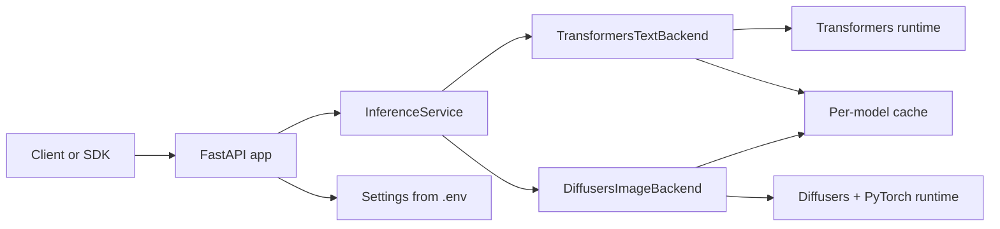
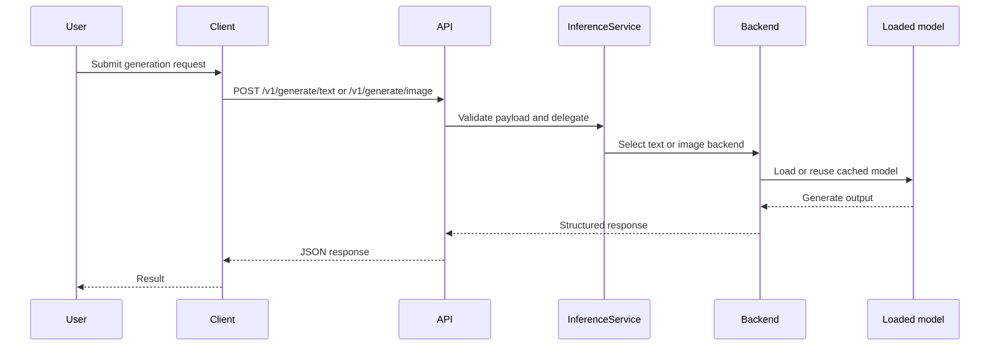

# HF Inference Platform

HF Inference Platform is a Python-first scaffold for serving Hugging Face workloads behind a stable HTTP API and a matching Python SDK. It is aimed at teams that want a clean starting point for inference hosting without pretending that text generation, diffusion pipelines, runtime policy, and client ergonomics are all the same problem.

The repository deliberately separates transport, orchestration, and model runtime concerns. FastAPI exposes a thin API surface, `InferenceService` wires the platform together, and backend adapters keep model-specific behavior isolated so the public contract can stay stable while the serving runtime evolves.

> This codebase is best understood as a platform skeleton. It gives you the API contract, configuration model, SDK, and optimization guidance you need to start responsibly, then leaves space for you to add queueing, tenancy, observability, and production scheduling on top.

## Table of contents

- [Why this repository exists](#why-this-repository-exists)
- [What the platform includes](#what-the-platform-includes)
- [Architecture at a glance](#architecture-at-a-glance)
- [Tech stack and why it is here](#tech-stack-and-why-it-is-here)
- [Quick start](#quick-start)
- [API surface](#api-surface)
- [Configuration model](#configuration-model)
- [SDK and benchmarking](#sdk-and-benchmarking)
- [Project layout](#project-layout)
- [Operational guidance](#operational-guidance)
- [Documentation map](#documentation-map)
- [Recommended next steps](#recommended-next-steps)

## Why this repository exists

Inference systems usually become difficult when teams mix together concerns that should stay separate. HTTP handling, request validation, model loading, device placement, compile strategy, and client integration all move at different speeds. This scaffold gives each one a clear place so you can change a runtime decision without rewriting the rest of the platform.

The current design favors a practical split. Text generation stays easy to debug through plain Transformers, while image generation stays close to the Hugging Face Diffusers pipeline model that most teams already understand. That keeps correctness work simple in the early stages and still leaves a direct path to vLLM or TGI once throughput and batching pressure become the real bottleneck.[^runtime-split]

## What the platform includes

| <sub>#</sub> | <sub>Area</sub> | <sub>What it does</sub> | <sub>Why it matters</sub> |
| --- | --- | --- | --- |
| <sub>1</sub> | <sub>FastAPI service</sub> | <sub>Exposes health, catalog, text generation, and image generation endpoints.</sub> | <sub>Gives platform users and internal tooling a stable HTTP contract.</sub> |
| <sub>2</sub> | <sub>Backend adapters</sub> | <sub>Separates Transformers text serving from Diffusers image serving.</sub> | <sub>Keeps model-runtime logic isolated so the service contract stays cleaner.</sub> |
| <sub>3</sub> | <sub>Settings layer</sub> | <sub>Controls device, dtype, CPU offload, compile behavior, NSFW policy, and port settings.</sub> | <sub>Makes deployment policy explicit instead of hidden in request handlers.</sub> |
| <sub>4</sub> | <sub>Python SDK</sub> | <sub>Wraps common API calls for health checks, catalog reads, text generation, and image generation.</sub> | <sub>Reduces duplicate client code across internal tools and experiments.</sub> |
| <sub>5</sub> | <sub>Benchmark script</sub> | <sub>Sends repeated requests and reports mean, p95, min, and max latency.</sub> | <sub>Lets you catch slow paths before they turn into operational folklore.</sub> |
| <sub>6</sub> | <sub>Docs set</sub> | <sub>Captures architecture, optimization guidance, and audit prompts.</sub> | <sub>Helps the repository function as a starting platform instead of a code dump.</sub> |

This table shows the main building blocks shipped in the repository today. The emphasis is on platform shape and operational clarity, not on pretending that this scaffold already includes every production control-plane feature.

> [!IMPORTANT]
> This repository does not ship queueing, tenancy isolation, autoscaling, request batching, or observability pipelines out of the box. Those concerns are intentionally left for the platform owner because the correct design depends on workload shape, compliance requirements, and infrastructure constraints.

## Architecture at a glance

The implementation is intentionally thin at the edge. The API layer validates requests and delegates immediately. `InferenceService` owns backend composition, while the backends own caching, model loading, and runtime-specific execution behavior. That separation keeps the call path readable and makes future runtime swaps easier.



The diagram shows how requests move through the service. Transport remains simple, orchestration sits in one place, and runtime-specific concerns stay in backend adapters where they can evolve independently.

| <sub>#</sub> | <sub>Layer</sub> | <sub>Current implementation</sub> | <sub>Responsibility</sub> |
| --- | --- | --- | --- |
| <sub>1</sub> | <sub>Transport</sub> | <sub>FastAPI in `src/hf_inference_platform/main.py`</sub> | <sub>Defines endpoints, response models, and API entrypoints.</sub> |
| <sub>2</sub> | <sub>Service composition</sub> | <sub>`InferenceService` in `src/hf_inference_platform/service.py`</sub> | <sub>Constructs and exposes the active text and image backends.</sub> |
| <sub>3</sub> | <sub>Text runtime</sub> | <sub>`TransformersTextBackend`</sub> | <sub>Loads tokenizers and causal language models, caches them, and runs text generation.</sub> |
| <sub>4</sub> | <sub>Image runtime</sub> | <sub>`DiffusersImageBackend`</sub> | <sub>Loads text-to-image pipelines, applies device and compile decisions, and returns base64 images.</sub> |
| <sub>5</sub> | <sub>Configuration</sub> | <sub>Pydantic settings in `src/hf_inference_platform/config.py`</sub> | <sub>Turns environment variables into explicit runtime behavior.</sub> |
| <sub>6</sub> | <sub>Client contract</sub> | <sub>`hf_inference_sdk.InferenceClient`</sub> | <sub>Provides a reusable Python client for platform consumers.</sub> |

This table maps the codebase to the responsibilities a platform team usually cares about first. It should help new maintainers locate where a change belongs before they start editing files.

<details>
<summary>Request flow details</summary>



This sequence emphasizes an important implementation detail: the API layer is intentionally not where model logic lives. That keeps the transport layer easy to inspect and lowers the risk of accidental hot-path drift in endpoint code.

</details>

## Tech stack and why it is here

The stack is intentionally conservative. It uses well-understood Python tooling for the control plane and keeps heavyweight inference dependencies optional so developers can work on the service and SDK without always pulling a full model-serving environment.

| <sub>#</sub> | <sub>Technology</sub> | <sub>Role in the repository</sub> | <sub>Why it is needed here</sub> |
| --- | --- | --- | --- |
| <sub>1</sub> | <sub>Python 3.11+</sub> | <sub>Primary implementation language.</sub> | <sub>Keeps service code, SDK code, and inference integrations in one ecosystem.</sub> |
| <sub>2</sub> | <sub>FastAPI</sub> | <sub>HTTP framework for the service.</sub> | <sub>Provides strong request validation and automatic API docs without much glue code.</sub> |
| <sub>3</sub> | <sub>Pydantic and pydantic-settings</sub> | <sub>Schema validation and environment-driven settings.</sub> | <sub>Makes request contracts and runtime options explicit and typed.</sub> |
| <sub>4</sub> | <sub>Uvicorn</sub> | <sub>ASGI server for local and deployed service runs.</sub> | <sub>Gives the FastAPI app a straightforward runtime entrypoint.</sub> |
| <sub>5</sub> | <sub>httpx</sub> | <sub>HTTP client used by the SDK and benchmark tooling.</sub> | <sub>Keeps client behavior simple and testable.</sub> |
| <sub>6</sub> | <sub>Transformers</sub> | <sub>Text generation backend runtime.</sub> | <sub>Acts as the correctness-first baseline for LLM serving.</sub> |
| <sub>7</sub> | <sub>Diffusers</sub> | <sub>Image generation backend runtime.</sub> | <sub>Matches the Hugging Face pipeline abstractions most diffusion teams already use.</sub> |
| <sub>8</sub> | <sub>PyTorch</sub> | <sub>Device execution, dtype control, and compile path.</sub> | <sub>Supports acceleration and model execution decisions for both runtime families.</sub> |
| <sub>9</sub> | <sub>Pytest, Ruff, Mypy</sub> | <sub>Validation and code quality toolchain.</sub> | <sub>Helps keep the scaffold honest as it grows.</sub> |

This table explains both the framework choices and the intent behind them. The key idea is that the stack is optimized for a maintainable inference scaffold, not for squeezing every last token-per-second from day one.

| <sub>#</sub> | <sub>Install profile</sub> | <sub>Command</sub> | <sub>Best fit</sub> |
| --- | --- | --- | --- |
| <sub>1</sub> | <sub>Control-plane only</sub> | <sub>`uv pip install -e '.[dev]'`</sub> | <sub>Local service development, tests, SDK work, and docs updates.</sub> |
| <sub>2</sub> | <sub>Inference runtime</sub> | <sub>`uv pip install -e '.[dev,inference]'`</sub> | <sub>Running Transformers and Diffusers workloads from this scaffold.</sub> |
| <sub>3</sub> | <sub>LLM throughput experiments</sub> | <sub>`uv pip install -e '.[dev,llm]'`</sub> | <sub>Evaluating vLLM integration paths beyond the default runtime.</sub> |
| <sub>4</sub> | <sub>Attention kernel experiments</sub> | <sub>`uv pip install -e '.[dev,flash]'`</sub> | <sub>Testing FlashAttention-specific optimizations when hardware and models justify it.</sub> |

This table summarizes the optional dependency groups declared in the package metadata. It is useful when you want to avoid a heavyweight local setup just to change API or SDK code.

> [!TIP]
> Start with the smallest dependency profile that matches the work you are doing. For most API, SDK, documentation, and schema changes, the `.[dev]` profile is enough and will keep feedback loops shorter.

## Quick start

The quick start below assumes you want the full local developer path, including inference dependencies. The commands create a virtual environment, install the package in editable mode, and start the FastAPI application so you can use the interactive docs and API endpoints immediately.

```bash
cd /home/kevin/Projects/hf-inference-platform
cp .env.example .env
uv venv
source .venv/bin/activate
uv pip install -e '.[dev,inference]'
uvicorn hf_inference_platform.main:app --reload
```

Open `http://127.0.0.1:8000/docs` after the server starts. That page is generated by FastAPI and is the fastest way to inspect the live request and response schema for the service.

| <sub>#</sub> | <sub>Step</sub> | <sub>What happens</sub> | <sub>Why the step exists</sub> |
| --- | --- | --- | --- |
| <sub>1</sub> | <sub>Copy `.env.example`</sub> | <sub>Creates a local environment file.</sub> | <sub>Keeps runtime configuration explicit and editable.</sub> |
| <sub>2</sub> | <sub>Create `.venv`</sub> | <sub>Builds an isolated Python environment.</sub> | <sub>Avoids dependency collisions with other projects.</sub> |
| <sub>3</sub> | <sub>Install editable package</sub> | <sub>Links the repo into the active environment.</sub> | <sub>Lets code changes take effect without reinstalling the package each time.</sub> |
| <sub>4</sub> | <sub>Run Uvicorn</sub> | <sub>Starts the ASGI app locally.</sub> | <sub>Exposes the service endpoints and OpenAPI docs.</sub> |

This table turns the quick start into a short operational checklist for new contributors. It is especially useful for teammates who know Python well but are new to this specific repository.

> [!NOTE]
> If you only need the control plane, SDK, and tests, install `.[dev]` instead of `.[dev,inference]`. That path avoids heavyweight model dependencies while still covering most repository work.

## API surface

The current HTTP surface is intentionally small. It focuses on health visibility, capability discovery, and two generation routes that map directly to the two built-in backend families. That gives consumers a compact contract and makes runtime behavior easier to reason about.

| <sub>#</sub> | <sub>Endpoint</sub> | <sub>Method</sub> | <sub>What it returns</sub> | <sub>Why it exists</sub> |
| --- | --- | --- | --- | --- |
| <sub>1</sub> | <sub>`/healthz`</sub> | <sub>`GET`</sub> | <sub>Service status, NSFW policy flag, and default device.</sub> | <sub>Supports liveness checks and fast runtime inspection.</sub> |
| <sub>2</sub> | <sub>`/v1/catalog`</sub> | <sub>`GET`</sub> | <sub>Capability records emitted by the active text and image backends.</sub> | <sub>Helps clients discover what workload classes the platform is shaped for.</sub> |
| <sub>3</sub> | <sub>`/v1/generate/text`</sub> | <sub>`POST`</sub> | <sub>Generated text, latency, backend name, and metadata.</sub> | <sub>Provides a correctness-first text generation surface.</sub> |
| <sub>4</sub> | <sub>`/v1/generate/image`</sub> | <sub>`POST`</sub> | <sub>Base64-encoded image output, latency, backend name, and metadata.</sub> | <sub>Provides a simple diffusion-serving interface for image generation.</sub> |

This table is the contract summary a client developer usually needs first. The responses intentionally include backend metadata so you can inspect runtime choices without guessing what the server did internally.

<details>
<summary>Example requests</summary>

Text generation:

```bash
curl -X POST http://127.0.0.1:8000/v1/generate/text \
  -H 'content-type: application/json' \
  -d '{
    "model_id": "distilgpt2",
    "prompt": "Write a short deployment checklist for an LLM API.",
    "max_new_tokens": 64
  }'
```

Image generation:

```bash
curl -X POST http://127.0.0.1:8000/v1/generate/image \
  -H 'content-type: application/json' \
  -d '{
    "model_id": "runwayml/stable-diffusion-v1-5",
    "prompt": "studio product photography, camera on tripod, tungsten highlights",
    "num_inference_steps": 20,
    "height": 512,
    "width": 512
  }'
```

These examples match the request models currently defined in the codebase. They are good smoke tests for local bring-up and useful examples for SDK consumers building payloads manually.

</details>

## Configuration model

Configuration is handled through `pydantic-settings`, which means environment variables become a typed `Settings` object at runtime. This is an important design choice because it makes infrastructure policy visible in one place instead of scattering it across request handlers and backend code.

| <sub>#</sub> | <sub>Environment variable</sub> | <sub>Default</sub> | <sub>What it controls</sub> |
| --- | --- | --- | --- |
| <sub>1</sub> | <sub>`HF_TOKEN`</sub> | <sub>`None`</sub> | <sub>Authentication for private or gated Hugging Face models.</sub> |
| <sub>2</sub> | <sub>`ALLOW_NSFW`</sub> | <sub>`true`</sub> | <sub>Platform-level policy flag for NSFW enablement.</sub> |
| <sub>3</sub> | <sub>`DEFAULT_DEVICE`</sub> | <sub>`auto`</sub> | <sub>Selects `auto`, `cpu`, or `cuda` device routing.</sub> |
| <sub>4</sub> | <sub>`DEFAULT_TORCH_DTYPE`</sub> | <sub>`auto`</sub> | <sub>Controls dtype selection such as `float16`, `bfloat16`, or `float32`.</sub> |
| <sub>5</sub> | <sub>`ENABLE_TORCH_COMPILE`</sub> | <sub>`false`</sub> | <sub>Enables the compile path for supported runtime components.</sub> |
| <sub>6</sub> | <sub>`ENABLE_REGIONAL_COMPILE`</sub> | <sub>`true`</sub> | <sub>Prefers regional or repeated-block compilation when available.</sub> |
| <sub>7</sub> | <sub>`ENABLE_CPU_OFFLOAD`</sub> | <sub>`false`</sub> | <sub>Allows offloading to CPU for memory relief at possible latency cost.</sub> |
| <sub>8</sub> | <sub>`ENABLE_MODEL_WARMUP`</sub> | <sub>`false`</sub> | <sub>Reserved switch for warmup-oriented startup behavior.</sub> |
| <sub>9</sub> | <sub>`SERVICE_PORT`</sub> | <sub>`8000`</sub> | <sub>Sets the local or deployed HTTP port.</sub> |

This table mirrors the actual settings object in the service. It is the most important reference for deployment policy because these values influence both correctness and latency characteristics.

The NSFW setting deserves explicit attention. The scaffold does not hardcode a platform-wide content block. Instead, it exposes policy as configuration so deployments can make a deliberate decision based on product requirements, model licenses, and moderation expectations.[^nsfw]

> [!CAUTION]
> CPU offload and compile flags can materially change latency behavior. Enable them because you measured a benefit on your target hardware, not because they look like default performance wins on paper.

## SDK and benchmarking

The repository includes a small Python SDK so internal tools and quick experiments do not have to hand-roll HTTP requests. The SDK intentionally stays thin: it mirrors the service endpoints closely, surfaces server errors through `httpx`, and keeps the public client contract simple.

The benchmark script is equally direct. It posts a payload repeatedly and reports summary latency statistics. That is enough for first-pass comparisons between models, prompt shapes, and runtime flags, even before you build more advanced observability.

| <sub>#</sub> | <sub>Tool</sub> | <sub>Location</sub> | <sub>Primary use</sub> |
| --- | --- | --- | --- |
| <sub>1</sub> | <sub>SDK client</sub> | <sub>`src/hf_inference_sdk/client.py`</sub> | <sub>Programmatic access to health, catalog, text, and image endpoints.</sub> |
| <sub>2</sub> | <sub>Benchmark utility</sub> | <sub>`scripts/benchmark.py`</sub> | <sub>Quick latency measurement for repeated text or image requests.</sub> |

This table highlights the two main consumer-facing helpers in the repository. Both are intentionally lightweight so they can act as stable building blocks rather than hidden frameworks.

<details>
<summary>Python SDK example</summary>

```python
from hf_inference_sdk import InferenceClient

client = InferenceClient("http://127.0.0.1:8000")

health = client.health()
catalog = client.catalog()
text_result = client.generate_text(
    {
        "model_id": "distilgpt2",
        "prompt": "Summarize why typed settings improve deployability.",
        "max_new_tokens": 64,
    }
)
```

This example mirrors the actual SDK methods provided by the repository today. It is useful when wiring notebooks, internal CLIs, or smoke tests against a local or shared deployment.

</details>

<details>
<summary>Benchmark example</summary>

```bash
python scripts/benchmark.py \
  --url http://127.0.0.1:8000/v1/generate/text \
  --kind text \
  --model-id distilgpt2 \
  --runs 5 \
  --prompt "Write a short note on why latency percentiles matter."
```

The benchmark output includes `mean_seconds`, `p95_seconds`, `min_seconds`, and `max_seconds`. That makes it a good first checkpoint when you change a model, compile setting, or device strategy and want a fast answer before running deeper profiling.

</details>

## Project layout

The repository layout mirrors the separation of concerns in the architecture. Service code, client code, scripts, tests, and design notes all live in predictable places so contributors can navigate from a requirement to the relevant implementation surface quickly.

| <sub>#</sub> | <sub>Path</sub> | <sub>What lives there</sub> | <sub>Why it matters</sub> |
| --- | --- | --- | --- |
| <sub>1</sub> | <sub>`src/hf_inference_platform`</sub> | <sub>Service code, settings, runtime helpers, schemas, and backend adapters.</sub> | <sub>Contains the core platform implementation.</sub> |
| <sub>2</sub> | <sub>`src/hf_inference_sdk`</sub> | <sub>The Python client package.</sub> | <sub>Defines the reusable consumer-side API contract.</sub> |
| <sub>3</sub> | <sub>`scripts`</sub> | <sub>Benchmark and operational helper scripts.</sub> | <sub>Supports quick testing and measurement.</sub> |
| <sub>4</sub> | <sub>`docs`</sub> | <sub>Architecture notes, optimization guidance, and audit material.</sub> | <sub>Captures design reasoning outside the source tree.</sub> |
| <sub>5</sub> | <sub>`tests`</sub> | <sub>Focused tests for configuration and SDK behavior.</sub> | <sub>Provides a correctness baseline for the scaffold.</sub> |
| <sub>6</sub> | <sub>`configs`</sub> | <sub>Reserved configuration assets and environment-specific material.</sub> | <sub>Gives the project a home for future deployment configuration growth.</sub> |

This layout table is the quickest orientation guide for new maintainers. It also makes it easier to keep future additions in the right place instead of letting the repo flatten into a single undifferentiated source directory.

## Operational guidance

The repository includes sensible defaults, but defaults are not the same thing as deployment truth. Real performance depends on model family, image size, prompt distribution, device memory, driver versions, and whether your bottleneck is compute, memory movement, or batching inefficiency.

- Treat plain Transformers serving as the correctness baseline for text workloads.
- Keep diffusion workloads in Diffusers and PyTorch until you have a model-specific reason to go lower-level.
- Benchmark scheduler choices and denoising step counts instead of assuming defaults are good enough.
- Use compile selectively on repeated blocks rather than compiling an entire pipeline unless measurement says otherwise.
- Be suspicious of CPU offload unless memory pressure is the main constraint.
- Watch for accidental model reloads, tokenizer reloads, and per-request setup costs in hot paths.

These tips align with the guidance captured in the optimization and audit documents. They are here to keep the README useful for operators, not just for people cloning the repo for the first time.

| <sub>#</sub> | <sub>Workload type</sub> | <sub>Prefer first</sub> | <sub>Revisit when</sub> |
| --- | --- | --- | --- |
| <sub>1</sub> | <sub>Single-node text generation</sub> | <sub>Transformers</sub> | <sub>You need higher throughput, continuous batching, or better KV-cache scheduling.</sub> |
| <sub>2</sub> | <sub>High-throughput LLM serving</sub> | <sub>vLLM or TGI evaluation</sub> | <sub>Latency and utilization are limited by the baseline Python runtime.</sub> |
| <sub>3</sub> | <sub>Text-to-image generation</sub> | <sub>Diffusers + PyTorch</sub> | <sub>You have model-specific evidence that another runtime yields better economics.</sub> |
| <sub>4</sub> | <sub>Memory-constrained GPU serving</sub> | <sub>Selective offload and dtype tuning</sub> | <sub>You can quantify the latency tradeoff and still meet service goals.</sub> |

This decision table summarizes the runtime direction implied by the current scaffold. It is not a rulebook, but it is a useful default map for teams deciding where to spend optimization effort first.

## Documentation map

The README gives the broad platform picture, while the documents in `docs/` go deeper on specific topics. Reading them in the right order makes the repository easier to adopt and extend.

| <sub>#</sub> | <sub>Document</sub> | <sub>Focus area</sub> | <sub>When to read it</sub> |
| --- | --- | --- | --- |
| <sub>1</sub> | <sub>`docs/architecture.md`</sub> | <sub>Service shape and runtime boundaries.</sub> | <sub>When you need to understand the platform structure before making code changes.</sub> |
| <sub>2</sub> | <sub>`docs/optimization-guide.md`</sub> | <sub>Inference tuning guidance for Diffusers, Transformers, and compile strategy.</sub> | <sub>When latency, memory use, or throughput become the focus.</sub> |
| <sub>3</sub> | <sub>`docs/audit-playbook.md`</sub> | <sub>Review guidance for AI-generated or rapidly produced inference code.</sub> | <sub>When you need a checklist to catch hidden hot-path and correctness issues.</sub> |

This table is the documentation index for the repository. It helps readers move from the overview in this README into the more specialized guidance that supports production hardening.

## Recommended next steps

The current repository is a strong foundation, but a real platform will need additional layers around it. The list below is ordered around the gaps most likely to matter once traffic, model count, and organizational usage grow.

- [ ] Add queueing, admission control, and explicit tenancy boundaries.
- [ ] Introduce observability for latency, model load time, cache hit rate, and device utilization.
- [ ] Split high-throughput text serving onto vLLM or TGI when batching pressure justifies it.
- [ ] Add model warmup flows if cold-start behavior becomes user-visible.
- [ ] Expand tests around service endpoints and backend metadata.
- [ ] Benchmark the exact models, prompts, image sizes, and hardware you plan to operate.
- [ ] Audit any AI-generated runtime changes against `docs/audit-playbook.md` before merging.

This checklist is intentionally practical. It points at the work that turns a useful scaffold into an operational inference platform.

[^runtime-split]: The catalog emitted by the current service already reflects this design by advertising Transformers for text-generation and Diffusers for text-to-image, while explicitly recommending vLLM or TGI for higher-throughput LLM serving.
[^nsfw]: The repository exposes `ALLOW_NSFW` as a deployment setting, but actual safety behavior can still vary by model because some model packages include their own safety checker or content-filtering logic.
